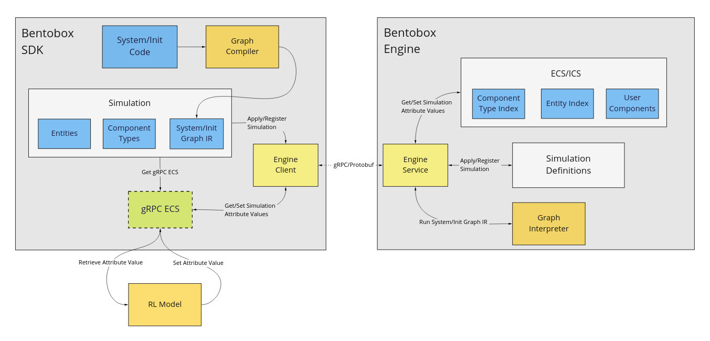

# bento-box
[](https://github.com/bentobox-dev/bento-box/actions/workflows/ci.yaml)
[](https://pypi.org/project/bentobox/)
[](https://opensource.org/licenses/MIT)

**bento-box** makes building performant and maintainable simulations simple:
- Write simulations in clean &amp; compact Python code using bentobox-sdk
- Run the simulations fast on the **bentobox-engine** C++ runtime
- Enforce good software architecture using the Entity Component System (ECS) to structure code
- Decouple simulation definition from execution, making it easy to scale simulations using cloud computing.

## Introduction



When developing simulations (ie for reinforcement learning (RL)), developers
typically have to make a trade off between simplicity and performance:
- Simulations written using higher level languages like Python are plagued with worse performance.
- Simulations written in lower level languages like C++ are difficult to write and maintain.

**bento-box** (**bentobox-sdk**) compiles simulations written in Python into a
Computation Graph which can than be executed on the **bentobox-engine** C++ runtime.
This (theorically) should give the best of both worlds, allowing simulation code
to remain simple and maintainable while running fast on the C++ runtime.

## Example
1. Develop your simulation using **bentobox-sdk**. This example simulates a AND logic gate.
```python
# define the schema of component types used in the simulation
# here we define a component type to represent input/output pins
Pin = ComponentDef(
    name="pin",
    schema={
        "first_input": types.boolean,
        "second_input": types.boolean,
        "output": types.boolean,
    },
)

# define the simulation by specifying its component types and entities
AndGate = SimulationDef(
    name="and_gate",
    components=[Pin],
    entities=[
        # define an entity to represent the AND logic gate
        EntityDef(components=[Pin]),
    ],
)

# write the initization code used to initialize component values
@AndGate.init
def init_fn(g: Plotter):
    gate = g.entity(components=[Pin])
    gate[Pin].first_input = False
    gate[Pin].second_input = False
    gate[Pin].output = False

# implement the system that specifies the logic of the And Gate
@AndGate.system
def and_gate(g: Plotter):
    gate = g.entity(components=[Pin])
    if gate[Pin].first_input and gate[Pin].second_input:
        gate[Pin].output = True
    else:
        gate[Pin].output = False
```

2. Connect to **bentobox-engine** using **bentobox-sdk**'s `Client`
```python
client = Client(host="bento.example.com", port=54242)
```

3. Run the simulation on **bentobox-engine**:
```python
sim = Simulation.from_def(AndGate, client=client)

# with: registers and starts the simulation
with sim:
    # interact with the simulation on the bentobox-engine transparently
    sim[Pin].first_input = True
    sim[Pin].second_input = True
    # run on step of the simulation
    sim.step()
    # access component values transparently
    assert sim[Pin].output == True
```

## Setup
### Install bentobox-sdk
Requires: Python 3.6 and above.
Install **bentobox-sdk** using `pip`:
```sh
pip install bentobox
```

### Deploy bentobox-engine
**bentobox-engine** can be deployed with Docker or Kubernetes (Kustomize):

#### Deploy with Docker
Start an instance of **bentobox-engine** with Docker:
```
docker run -p 54242:54242  ghcr.io/bentobox-dev/bentobox-engine
```

#### Deploy with Kubernetes
**bentobox-engine** can deployed on Kubernetes using the Kustomize:
- Creates a `LoadBalancer` service that listens on port 54242.
```
kustomize build infra/kustomize/engine | kubectl apply -f -
```

## Documentation
[API documentation for **bentobox-sdk**](https://bentobox-dev.github.io/bento-box/)
